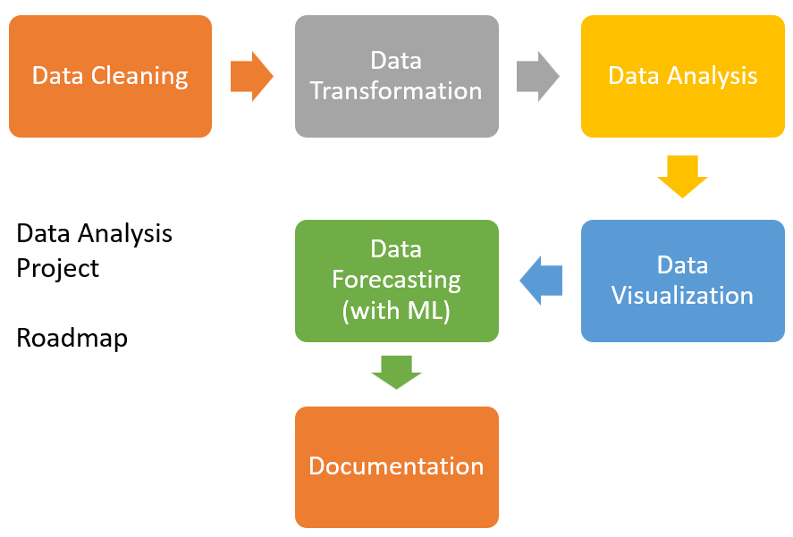

# A data analysis of Carbon dioxide emission Vs GDP per capita

  

Research Question: What are the impacts of Co2 emission(climate change) on GDP per capita(financial stability)?

Brief: we are interested in performing a full data analysis study on climate change datasets that are publicly available.  Based on our preliminary research, we discovered that CO2 emissions are the most damaging environmental component, while the GDP per capita is an urgent issue that must be addressed. Therefore, we will analyze and compare the subsequent effects of CO2 and GDP on global climate change for some developed(USA and Japan) and developing(Russia and India) countries. 

## Method of Data Analysis included,
* Descriptive Analysis
* Exploratory Data Analysis
* Diagnostic Analysis
* Predictive analysis

## Project Structure

[1_data_preparation](https://github.com/kankaungmalay/data_analysis_co2_vs_gdp/tree/main/1_data_preparation) - All the files which are used to prepare the final dataset. 

[2_datasets](https://github.com/kankaungmalay/data_analysis_co2_vs_gdp/tree/main/2_dataset) - Final dataset of the project and its related files.

[3_data_analysis](https://github.com/kankaungmalay/data_analysis_co2_vs_gdp/tree/main/3_data_analysis) - All the data analysis source code files. 

[4_data_visualization](https://github.com/kankaungmalay/data_analysis_co2_vs_gdp/tree/main/4_data_visualization) - All the data visualization file.

